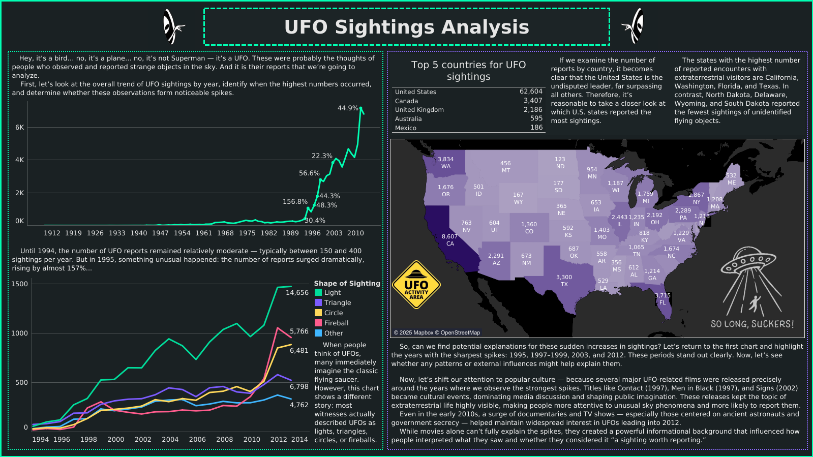

# 🛸 UFO Sightings Intelligence Center & Analytics Dashboard

An interactive, high-fidelity data analytics command deck for exploring historical UFO sightings (1949 – 2014). This project features a dark sci-fi HUD theme, custom Web Audio synthesis, interactive neon charts, and advanced 3D WebGL visualizers built using Three.js and Chart.js.



---

## 🛠️ Technology Stack & Architecture

- **Frontend Core**: Vanilla HTML5, CSS3, and modern JavaScript (ES Modules).
- **WebGL 3D Engine**: [Three.js](https://threejs.org/) for rendering the interactive Earth, flying saucer, starfield, and alien head.
- **Data Visualizations**: [Chart.js](https://www.chartjs.org/) (v4) for responsive, glowing 2D widgets.
- **Build System & Dev Server**: [Vite](https://vitejs.dev/) for hot module reloading and production bundling.
- **Data Preprocessor**: Python 3 (Pandas, Numpy) to clean the messy raw NUFORC dataset and pre-aggregate files.
- **Synthesizer Engine**: Web Audio API to generate real-time ambient hums and interface sound effects.

---

## 👽 Core Features & Visual Capabilities

### 1. Interactive 3D WebGL Graphics (Three.js)
The project integrates four distinct WebGL graphics scenes generating custom geometric models dynamically (100% offline-ready):
- **Fullscreen Landing UFO**: A detailed 3D flying saucer rendered with shiny metallic textures, a glowing cyan dome, and a pulsing bottom tractor beam. Features a ring of 12 peripheral lights cycling in a circular chase sequence.
- **Parallax Starfield**: A particle system simulating travel through a deep space tunnel at warp speed. Mouse movements generate dynamic parallax depth shifts.
- **HUD Logo**: A mini, wireframe spinning saucer embedded in the header bar.
- **Holographic Alien Analyzer**: A spinning wireframe alien head with oversized dark eyes resting over a rotating tactical grid platform. Flickers randomly with digital scan line glitches to simulate a military terminal.

### 2. 3D Geospatial Earth Globe
A central WebGL Earth globe that maps sighting locations dynamically:
- **Cyber Grid Globe**: Globe modeled with a dark sea material wrapped in glowing cyan grid lines (latitudes/longitudes) and city light textures.
- **Color-Coded Sighting Beacons**: Projects 3D cylinder pins rising from coordinates on the Earth's surface. Pins are color-coded based on the UFO's shape (Gold for light, Green for sphere, Purple for triangle, Cyan for cylinder/disk, Orange for formations, Red for fireball).
- **Raycaster Interactivity**: Hovering over coordinate beacons highlights them, while clicking opens a holographic details card and smoothly pivots/zooms the camera to focus on the coordinate via LERP interpolation.
- **Graceful Degradation**: Wraps WebGL initialization in try-catch logic. If GPU acceleration is disabled or unavailable in the browser, the page displays a warning in the map slot but keeps all other 2D charts and tables fully active.

### 3. Animated Neon Charts
Integrates four responsive Chart.js instances styled with glowing neon gradients:
- **Live Activity Trend (Cyan)**: Line chart illustrating yearly sighting frequencies with linear gradient fills.
- **Inventory Distribution (Purple)**: Horizontal bar chart categorizing the top 10 most common UFO shapes.
- **Seasonal Patterns (Multi-color)**: Polar area chart mapping sighting densities by month.
- **Peak Hours (Green)**: Area chart showcasing hour-by-hour sightings, highlighting the heavy night-time spike.

### 4. Custom Sci-Fi HUD Design System
- **Neon Theme**: Dominated by space black (`#030508`), cyan (`#00f0ff`), alien green (`#39ff14`), and purple (`#bc00dd`).
- **Tactical Corner Brackets**: Card containers styled with backdrop-filter blur and custom L-shaped corner brackets (`::before`/`::after` overrides).
- **CRT Tube Scanlines**: Fixed scanline overlay mimicking an old green-phosphor CRT radar monitor.
- **Holographic Inputs**: Cyber-styled search box, timeline range sliders, and dropdown menus.

### 5. Web Audio Space Synthesizer
Synthesizes retro-futuristic sound effects programmatically inside the browser:
- **Engine Hum**: Modulates a low C2 sawtooth wave with a slow sine LFO to create a background ship hum.
- **Digital blips**: Quick frequency-decay sine waves for button clicks.
- **Tractor beam**: A logarithmic frequency sweep with a low-pass filter to transition into the command deck.

---

## 📁 Project Structure

```
├── public/
│   └── data/               # Pre-aggregated dashboard datasets (JSON)
│       ├── summary.json
│       ├── sightings_by_year.json
│       ├── map_sightings.json
│       └── ...
├── src/
│   ├── app.js              # Application state and controller logic
│   ├── ufo3d.js            # Three.js 3D models and landing screen
│   ├── globe.js            # WebGL interactive Earth Globe
│   ├── charts.js           # Chart.js defaults and configurations
│   └── style.css           # Glassmorphism, grid layout, and neon styles
├── index.html              # Main viewport layout and error diagnostics
├── package.json            # Node dependencies and build scripts
├── process_data.py         # Dataset downloader, cleaning, and aggregator
├── ufo_data_clean.csv      # Full cleaned dataset output (77k records)
└── README.md
```

---

## 🚀 Getting Started & Local Setup

To run this project locally, follow these steps:

### Prerequisites
Make sure you have **Node.js** (v16+) and **Python 3** (with Pandas) installed on your system.

### Step 1: Prepare the Data
Run the data cleaning script to download the raw dataset, execute preprocessing, and compile the dashboard JSON chunks:
```bash
python process_data.py
```
*Note: This downloads the raw dataset (12MB) from GitHub and generates the files under `public/data/`.*

### Step 2: Install Node Dependencies
Initialize npm packages:
```bash
npm install
```

### Step 3: Run the Development Server
Launch the Vite local server:
```bash
npm run dev
```
Open the local URL in your web browser:
👉 **[http://127.0.0.1:5173/](http://127.0.0.1:5173/)**

Open the Official URL:
👉 **[https://yogeshswami0.github.io/UFO-ANALYSIS/](https://yogeshswami0.github.io/UFO-ANALYSIS/)

*Warning: Opening the `index.html` file directly using the `file://` protocol will fail, as browsers block modules, data fetches, and WebGL assets from running locally due to CORS security policies.*

### Step 4: Compile Production Build (Optional)
To package the app into a minified, lightweight build:
```bash
npm run build
```
The compiled HTML, CSS, and JS bundle will be generated under the `dist/` directory.

## Developed by
YOGESH SWAMI
